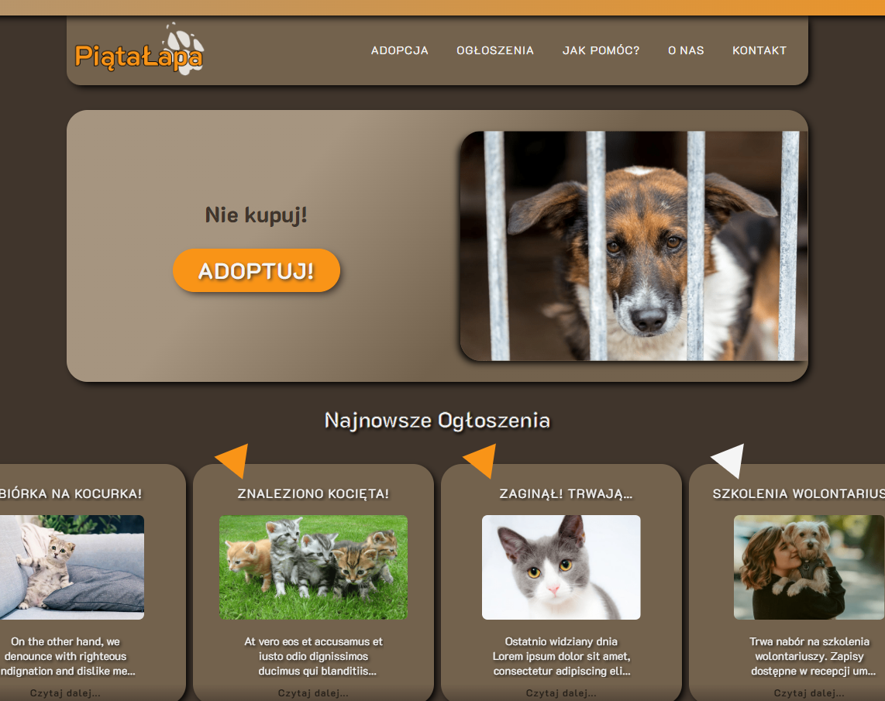
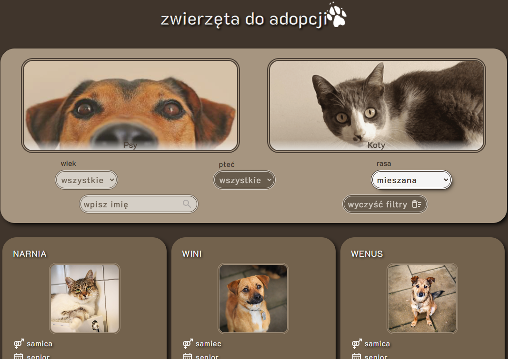

# Piata Łapa - Fifth Paw Animal Shelter

This project contains [Live view](https://aleksandramotor.github.io/FifthPaw/) of animal shelter "Piąta Łapa" (ang. Fifth Paw) website based my own responsive design.

## Technologies and libraries used

### `React` `TypeScript` `SASS`
#### `EmailJS` `React Hooks` `React Router` `React Icons` `React Alice Carousel` `Webpack` `Babel`

## Description

On the main site you will find menu with navigation tabs and logo, banner, widgets, CTA buttons, interactive `react-alice-carousel` and of course footer.

"Adoption" tab will take you to the list of pets available for adoption. The data was web scrapped from real life shelter websites, so all animals on display are available for adoption and links in info-cards will take you to the corresponding shelter websites. The filter section containing amongst others 'age', 'species' and search by name, will speedup the search for the perfect companion.

On this website you will find news articles section, contact page with google map location, interactive contact form created with `emailjs` and more.

Explore [Live view](https://aleksandramotor.github.io/FifthPaw/)
or 
check out my fimga project [FifthPaw Animal Shelter]({{file name='FifthPaw-AnimalShelterWebsite.png'}}).